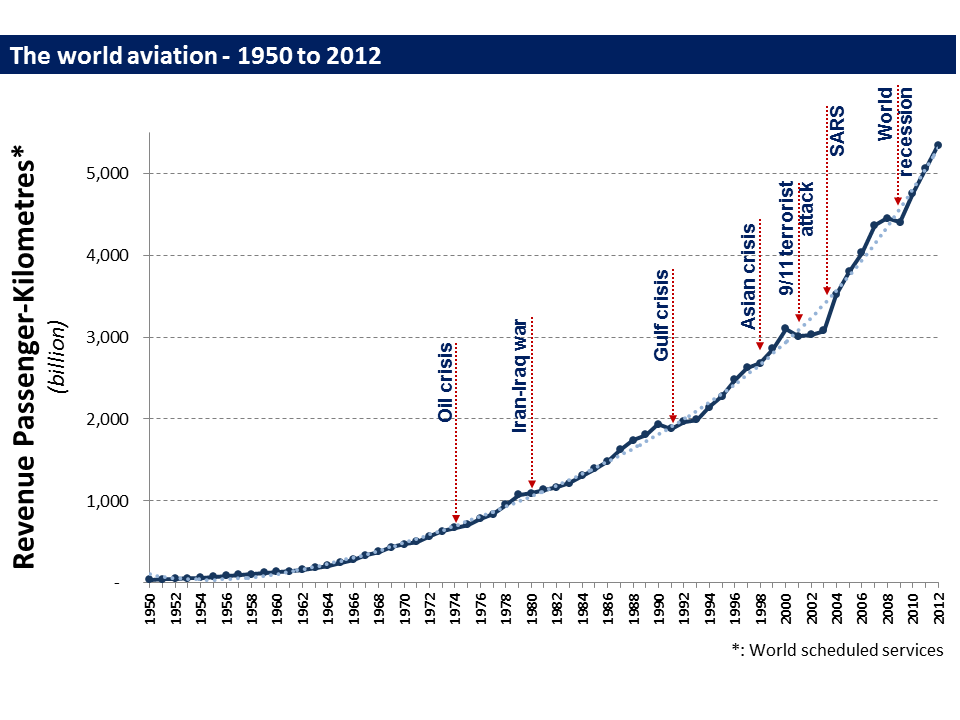
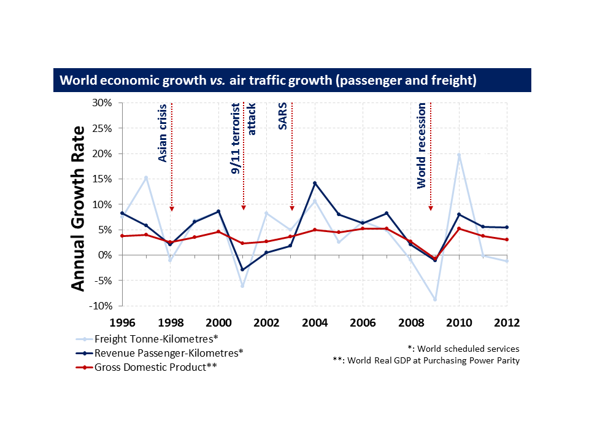

# Air Transport Evolution and Forecast before COVID-19 {#ATEvo}

The aviation industry has experienced a spectacular rise in the last 20 years,with passenger numbers more than doubling from 1.5 billion in 1998 to nearly 4 billion in 2017. The sector has been characterised for experiencing peak cycles and stagnation stages, but it is one of the most consolidated industries.

During the last years, airlines have been grounding the old aircraft, renewing their fleets with more fuel-efficient planes and serving more and more passengers.  With the emerge of the low-cost flights, flying have been extended to all public, forcing the airlines to become more sophisticated retailers to compete with the prices while maintaining healthy profitability.

It has become very common to hear about the healthy  of the sector and its promising future. All the institutions, including the ICAO, IATA and the two big manufacturers Boeing and Airbus forecast a continuous growth for the industry at least until 2040. The reason behind is the Asiatic continent.<br>
It is well known in both, the United States and Europe the commercial aviation is well established. Asia though, in the last decade is experiencing an unprecedented growth.<br>
The economical growth of the countries historically less developed, has resulted to be the best enhancer for the development of the Asiatic aviation and for the international traffic in general.
The development of the aviation in Asia has gone together with an increase of the middle class in the region, now having higher financial capacity to fly than ever. It is expected that by 2030 two-thirds of the world's middle class will be located in Asia-Pacific region. [@grupooneair]

```{r TForecast, echo=FALSE, out.width='80%', fig.align='center', fig.cap='Traffic Forecast for 2038. Source: [@Airbus_GMF].'}
knitr::include_graphics("images/Fotos_evo/av2038.jpg")
```

As said before, when discussing the air transport market, it is very common to hear the word "cyclically". The main reason is the number of cycles the industry has experimented since 1990. Analysing the last years of the industry, the first decade of the new millennium resulted to be the most significant with two global events: The 9/11 in 2001 and the financial crisis in 2008/2009. And one more regional, but no less difficult, the SARS outbreak in Asia. <br>
What made these more challenging was the fact of they followed one after the other. Even though, the traffic was able to rebound and return to its long term tendency. The Figure \@ref(fig:TF2038) gives an overall view of the revenues per passenger-kilometre growth of the last 70 years. It can be easily seen, despite the global events, the industry has been able to rebound and continue its growing tendency. As stated in GMF 2019-2039 by @Airbus_GMF *"the traffic has proven to be resilient to external shocks"*.

```{r TF2038, echo=FALSE, out.width='80%', fig.align='center', fig.cap='Traffic Forecast for 2038. Source: [@EcDevICAO].'}

```


The air transport industry has resulted to be not only very important in terms of global socio-economic growth but, a vital catalyst for economic development. The industry is creating direct and indirect employment, enhancing tourism and stimulating foreign investment as ICAO details in *Economic Development of Air Transport* [@EcDevICAO]. <br>
Since 1995 to 2012, and as represented in Figure \@ref(fig:WEG), the world passenger air traffic followed the tendency of the world economy. Annually the Gross Domestic Product (GDP) grew at 2.8\% while the passenger air traffic, expressed in Revenue Passenger- Kilometer increased at 5\%. 

```{r WEG, echo=FALSE, out.width='80%', fig.align='center', fig.cap='World Economic growth *vs* air traffic growth. Source: [@EcDevICAO].'}

```

Moving back to this last decade, from 2010 the industry has been free of events. This has allowed the industry to meet the needs of passengers, who have been unimpeded by the impact of these cycles. In consequence, the airlines have made almost the same profit from 2015 to 2019 than the one generated between 1970 and 2014.

The industry has lived its best years and are foreseen more to come. For the next 20 years, Airbus Global Market forecasts [@Airbus_GMF] a 4.3\% global annual air traffic growth. As mentioned, the key is the expansion of the sector in the Asia-Pacific region, which will lead the world traffic by 2038.

In terms of network, the year 2017-2018 was the most active in a new route creation. In fact, the last three years have been very positive when adding new routes, many of them being short-haul routes focusing on China and some between Africa and Europe. <br>
Long haul routes have also grown over this period with the emergence of long haul low-cost airlines like LEVEL, Norwegian and Eurowings, among others. 

```{r routesevo, echo=FALSE, out.width='60%', fig.align='center', fig.cap='Total route creation. Source: [@Airbus_GMF].'}
knitr::include_graphics("images/Fotos_evo/Routes_evo.png")
```


The present was in good health and the future forecast was promising.
The industry was going better like never before, giving the best future expectations of the sector's history. The airlines thought that they were ready for everything. Everything, except the imminent COVID-19 worldwide pandemic.
