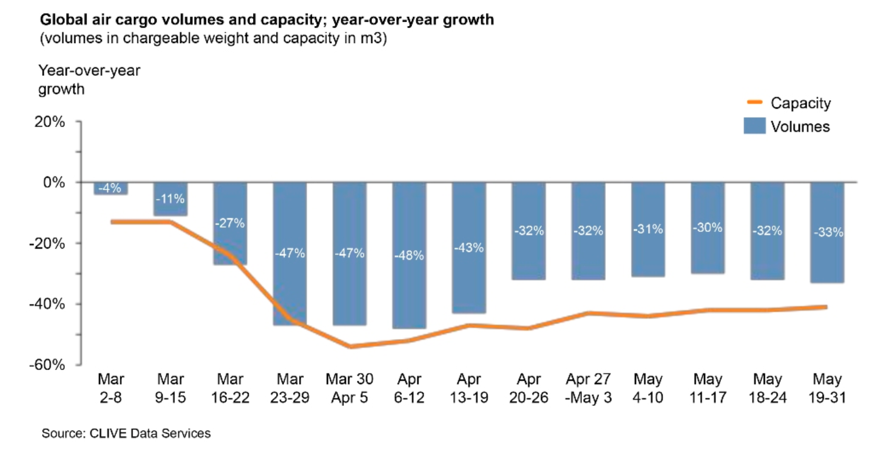
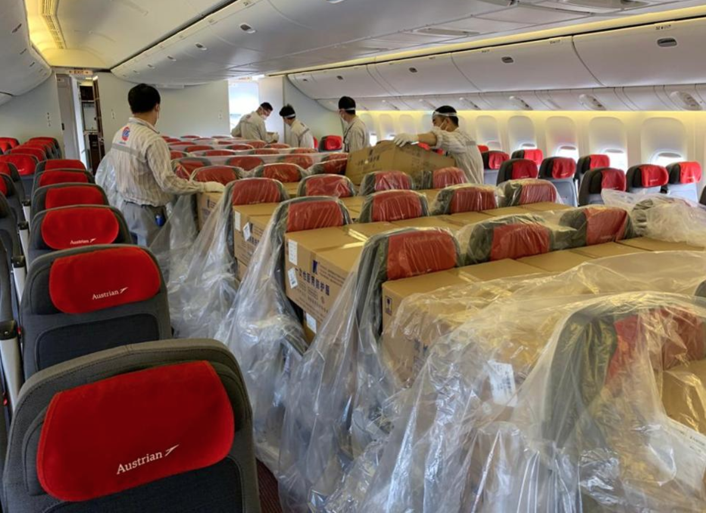
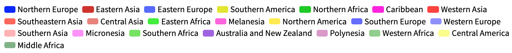

# Routes Impact Analysis {#Imp}

As Ben Baldanza, previous CEO and president of Spirit Airlines, says in [@USAirlinesSurvive], *"When flying and in trouble, no matters what it is, the altitude, the remaining fuel or even the radio communications. The first order of business is to keep the wings straight and level."* <br>
Somehow, this is the airline's mentality. In front of a totally new situation, their objective is to stay afloat. And the only way to do it is preserving cash. To do so, they are erasing those routes/frequencies temporary unprofitable or the law forbid to fly. 

This is what is going to be studied in the following section. But before proceeding to the analysis of these adjustments, it is explained the methodology followed.


## Methodology {#ImpMeth}

Firstly, it has been necessary to elaborate the database. From the latter will be generated the graphics and animations that will allow the explanation of the pandemic. In order to generate the database then, it is a requisite to have access to the schedule adjustments of the airlines. This information is usually private and it is necessary to pay for it. However, it has been found an alternative, an open source called <a href="https://www.routesonline.com/">*RoutesOnline*</a>. This is a webpage that has a section titled <a href="https://www.routesonline.com/news/38/airlineroute/">*"AirlineRoute"*</a>  in which they gather  the schedule adjustments from world's airlines. In front of the COVID-19 outbreak, it was created a specific section for the coronavirus pandemic. In the latter, <a href="https://www.routesonline.com/">*RoutesOnline*</a> has been collecting the airlines' adjustments since January 23 and will continue until the end of the pandemic. However, as they state in their webpage:

*"Airlineroute is run by a team of one (with the exception of Routes Editorial Opinion and Live Blog Post), and due to extraordinary numbers of flight adjustments, Airlineroute may not be able to cover every carrier, but will report them as many as possible."*

It is because of that, it cannot be ensured that the database lists all the adjustements applied by the airlines. Even though, and as it can be seen in the following pages, the information collected has allowed to face most of the project's objectives.

Once elaborated the database, the study has proceeded with the representation of the data. There have been created several animations to ease the understanding and to make the process as interactive as possible.
Finally, the animations have been studied and there have been extracted the related conclusions.


## Database {#ImpDat}

The schedules adjustments posted on <a href="https://www.routesonline.com/">*RoutesOnline*</a> required to be arranged and listed in an excel format. The *OnlineRoutes*'s post are not all  structured in the same manner, it is for this reason that the excel document has been manually elaborated.

In the following Table is shown the database structure:


```{r Example, echo=FALSE, message= FALSE}
library(readr)
library(kableExtra)
Example <- read_csv2("Data/Example.csv")
knitr::kable(Example,align = 'c', caption = "Database structure.") %>%
    kable_styling(font_size = 12) %>%
    scroll_box(width = "100%", height = "100%")
```


The database is structured in such a way that each row represents an adjustment in an airline's flight schedule. Following are explained each of the blanks to be filled: 


- __*Country*__: It states where the airline is based.
- __*Region*__: It classifies the previously mentioned country into a United Nations Statistics Division (UNSD) region.

```{r Regions, echo=FALSE, out.width='80%', fig.align='center', fig.cap='The United Nations geoscheme'}
knitr::include_graphics("images/impact/regions.png")
```

- __*Airiline*__: Name of the airline modifying its schedule.
- __*From*__: Origin of the route modified.
- __*To*__: Destination of the route modified.
- __*From (Airport)*__: Identification code of the origin airport. This value references to another database listing all the airports with their corresponding locations and identification codes. (See in See Appendix B)
- __*To (Airport)*__: Identification code of the destination airport. This value references to another database listing all the airports with their corresponding locations and identification codes. (See Appendix B)
- __*Type of ajustment*__: Identification number

    - __*1*__: Route Cancelled.
    
    - __*2*__: Route with a reduction in frequencies.
    
    - __*3*__: Route with an increase in frequencies.
    
    - __*4*__: Route closed for reservation.
    
- __*Frequencies (Before)*__: Number of frequencies scheduled before the modification.
    
- __*Frequencies (After)*__: Number of frequencies scheduled after the modification.
    
- __*Publication Date*__: Schedule adjustment notification date.
    
- __*Starting Date*__: The first day the adjustment applies. 
    
- __*Ending Date*__: Last day the adjustment applies.  

In the next table are detailed the main characteristics of the database^[The Database is attached in the Appendix A.] elaborated:

```{r InterestValues, echo=FALSE, message= FALSE}
library(readr)
library(kableExtra)
Database <- read_csv2("Data/Database.csv")
knitr::kable(Database[1:1,1:6],align = 'c', caption = "Database's characteristic values.") %>%
    kable_styling(font_size = 12) %>%
    scroll_box(width = "100%", height = "100%")
```


## Analysis {#ImpAn}

As mentioned, the objective of the following section, and as a main part of the project, is to analyze the data collected.
 
### The pandemic outbreak throughout the schedules adjustments {#ImpAn1}
 
 Firstly, it will be determined if the evolution of the COVID-19 pandemic can be represented throughout the evolution of the schedules adjustments. To do so, it will be used the next animation, in which are represented the affectations in the routes throughout the period studied.
 
 The schedules modifications have been represented depending on its nature:
 

- In <span style="color:red">red</span> are drawn the routes that have been canceled by some airline.
- In <span style="color:orange">orange</span> are represented those routes seeing a reduction in their frequencies.
- In <span style="color:green">green</span> represented those routes seeing an increase in their frequencies.
- In <span style="color:blue">blue</span> are plot the routes in which some airline have closed the reservation.

Below is attached the animation in question. By clicking the play button placed at the bottom left corner, the representation will start.
```{r space3, echo=FALSE,  out.height='0.0001%', fig.align='center'}
knitr::include_graphics("images/blank.png")
```


<div class="flourish-embed" data-src="Visualizations/EvolutionRoutes/index.html"><script src="Visualizations/EvolutionRoutes/flourish.embed.js"></script>
</div>
```{r MAP, echo=FALSE,  out.height='0.0001%', fig.align='center', fig.cap='Evolution of the affected routes by COVID-19.'}
knitr::include_graphics("images/blank.png")
```


The presentation starts on January 22, being visible the effects of the pandemic just the day after. On January 23, the city of Wuhan is placed under lockdown and with this, the first cancellations arise. Until   January 29, it can be seen the affectation takes place mainly at Eastern Asia in a radial form with the epicenter in Wuhan. Even though, some routes from Europe and North-America are being also altered. Some examples are those flown by  British, Lufthansa or American airlines to China, from now on canceled.

On January 30, the WHO (*World Health Organization*) declares the COVID-19 a global emergency. China has now reported cases in all its provincial divisions and countries like India and Philippines announce their first positives. Others like France, Italy, Germany or South Korea report new cases. On the same day and the day after of the WHO declaration, it becomes obvious the repercussion the virus will have on the air transport across the globe. The routes affected increase drastically, being now more international rather than domestic. Even tough and as the routes show, the virus is in its majority in Eastern Asia, specifically in China.

As February begins, some countries respond to the global emergency declaration from WHO. A growing number of states start introducing temperature sensors and scanners in their airports. Others like Bahamas, Indonesia, Mauritius or Israel introduce quarantine measures for those arriving from China or suspected of having the virus. This measure will be followed by countries around the globe in the next days.
These measures though, are rapidly not enough and the countries proceed to ban the flights from or to China. Some examples are Mauritius and Singapore (February 2), Israel (February 3), Indonesia and Turkey (February 5). Despite the efforts, the virus spread rapidly and more countries are infected during the month. The measures applied for China will be now applied for these. Even though, this can not be explained through the schedules adjustments. As represented the modifications grow gradually and all around Eastern Asia, being not visible any specific travel ban. 

However, it is interesting to notice the changes in the nature of adjustments. With the closure of the city of Wuhan, the adjustments in both long-haul and short-haul routes were all cancellations. This behavior changes on January 31-February 1, when several routes are "Closed for reservation". As it is detailed in Section \@ref(ImpAn6), this may be related with the airlines' strategy.

February is also complicated for Europe, Italy will become the third most affected country by the end of the month. In response, some countries introduce travel restrictions for passengers who had been in Italy: Switzerland (February 13), Turkey (February 16), Kuwait (February 20) and Mauritius (February 24) among others. Even though, no major affectations compared to the rest of Europe are visible. 
It starts to be noticeable on February 28, when El Al (Israel Airlines) cancels all flights to Italy following the travel limitations imposed by the Health and Interior ministries of the country.<br> 
One day after, on February 29, Italy has more than 1 K confirmed cases and South Korea more than 3 K. This same day, the Ministry of Health of Turkey announces the flight suspension to Italy, Iraq and South Korea, a measure that can be also seen in the map.

On March 1, the flag carrier of Italy (*Alitalia*) announces a frequency reduction to most of its domestic routes, clearly visible in the animation. During the next 6 days, other airlines will adjust their routes to Italy, even though, there are no significant adjustments. This changes rapidly on March 8.<br>
Italy, until now with only 10 municipalities of Lodi province under lockdown,  decides to extend the quarantine to the entire region of Lombardy and 14 regions more of the north of the country. This provokes new affectations in domestic and international routes, mainly from/to Europe. Even though, some long-haul routes from North and South America involving Rome airport are also affected. This is likely to be an anticipation move by the airlines who may predict what is coming: Europe will become the new epicenter of the pandemic.

On March 9 there are no significant changes in the overall scenario. However, one of the major airlines around the world, Emirates Airlines files some service changes. It is suffering from low demand caused by the pandemic, deciding to cancel some short-haul routes and idling some A380 of its fleet. <br>
One day after, on March 10, Europe tinges red. Italy announces the quarantine of the entire country. Italy is now the second most hit country with more than 10 K cases. Airports, that until this day were not affected, show now canceled routes. 


On March 11 there are more than 125 K cases around the world and the WHO declares the COVID-19 a global pandemic. More routes to/from Italy are canceled mainly to/from other European countries and North America.
This same day the president of The United States announces travel ban from Schengen Area to the US in bid to stem coronavirus. This measure will go into effect the Friday 13th of March^[The United Kingdom and Ireland were initially exempt but will be also included on March 17.], generating a cloud of canceled routes over the Atlantic sea.
From that day, the chaos is taking hold of Europe and its countries start proclaiming the state of alarm and the total confinement for their citizens: Portugal on March 13 followed by Spain on March 14 and Poland on March 15. Austria on March 16 and France and Belgium on March 17. Of the last are Greece and the UK on March 23. Until March 23 it is very complicated to detect any airline sprecific reaction, since the adjustments are widespread around Europe.


In the north of the African continent, on March 14/March 15 is visible a significant increase of canceled routes in Algeria and Morocco respectively. The affectations in Algeria are explained by the service cancellation to France by the flag airline, Air Algerie. Meanwhile, in Morocco, the adjustments are aintroduced by Royal Air Maroc after the Ministry of Foreign Affairs announced that all international passenger flights to and from the country would be suspended.

Back to March 13, in the Arabian peninsula, it can be seen an increase in affected routes, concretely in Kuwait. The reason behind is the total closure of Kuwait International Airport. The government takes this measure with the objective to isolate the country from the rest of the world. Kuwait becomes the first country to close completely its main airport as a preventive measure with 72 positive cases. Two days after, on March 15, Saudi Arabia announces the travel ban from/to the country. The airlines' response to this measure is clearly visible as the routes cancellations in Jeddah rise immediately.

In Russia, from March 13 and for an undetermined period of time, is limited the air traffic with Germany, Spain, France, and Italy. This measure is represented with an increase of canceled routes mainly in the Capital Moscow, and in St. Petersburg. Still in Easter Europe, the increase of adjustments is even more substantial on March 16. Russia introduces new limitations and Aeroflot, the flag carrier of the country, introduces new flight reductions in its schedule. This same day Uzbekistan closes its air borders and with it new cancellations arise. 

Jumping to southeastern Asia, on March 15, the city of Manila (Philippines) is placed under lockdown, generating new cancellations. This measure is also imposed on the city of Cebu the next day, forcing the flag carrier of the county, Cebu Pacific, to cancel its routes to/from Cebu from March 17. This generates a new raise in cancellations the same day the country is declared under a state of calamity for a tentative period of six months.

On March 17, China is still the country more hit, with 81 K positive cases. Italy presents 30 K and is followed by Spain with 16 K, which has just surpassed Iran. Meanwhile, on the other side of the Atlantic sea, until now with minor affectations,  the first measures start to arrive. <br>
In Peru, with 117 positive cases, come into effect the state of emergency announced the day before, and there are suspended all the international flights of passengers.<br>
On March 18 Chile enacts the state of alarm and the day after, in the Dominican Republic, President Medina announces the suspension of inbound air traffic. However, this measure cannot be seen in the data collected.<br>
Otherwise, on March 23, Colombia forbids international flights and Panama closes its air borders, center America tinges red. By that day, in South America, Brazil is the most hit country with more than 1.5 K cases, followed by Ecuador with 850 and Chile 663.
The most severe measures in Brazil will arrive on March 30 closing its borders, however, it is not visible any significant affectation.

Crossing again the Atlantic sea and back to March 19, Egypt closes their airports for international flights, being noticeable the increase of adjustments especially in Cairo.
In Southeastern Asia, Air Asia Thailand announces the suspension of all its international flights, as well as, the reduction in frequencies for its domestic routes. Both measures come into effect on March 22, being visible the increase of cancellations in the airports of the country, espacially in the capital, Bangkok.

On March 25 Australia ranks as the 17th most hit country, with 2.7 K cases. This day the country forbids its citizens to leave the country with only a few exceptions. This measure provokes a rise in schedule adjustments of those routes involving Australian airports. Three days after, on March 28, the Malaysian low-costs AirAsia and AirAsia suspend their operations tingeing the skies of Malaysia in red. 

Finally, in the last stage of the animation, from March 28 to April 7, some routes that were canceled or reduced start reopening or showing increments in their frequencies, being especially noticeable on March 29.    
  
In order to visualize the previous commented increases in late March, is attached the following graphic.

```{r space4, echo=FALSE,  out.height='0.0001%', fig.align='center'}
knitr::include_graphics("images/blank.png")
```


<div class="flourish-embed" data-src="Visualizations/NetFrequencies/index.html">
<link rel="stylesheet" type="text/css" href="Visualizations/NetFrequencies/style.css"  />
<script src="Visualizations/NetFrequencies/flourish.embed.js"></script></div>
```{r NET, echo=FALSE,  out.height='0.0001%', fig.align='center', fig.cap='Net Frequencies Curve'}
knitr::include_graphics("images/blank.png")
```


As it was predicted, in late March and early April it is visible a rise in frequencies increased, being especially noticeable on March 29. Even though the same day it can be seen there is a cancellation of 8 K frequencies. This can be somehow confusing, it is for this reason in the next lines is explained the reason found. 

The commercial scheduling consists of planning the destination, timings and frequencies to be flown by the airlines, being one of the key elements when defining their strategy. Commercial scheduling typically undergoes two major iterations per year: the summer and winter schedules. This year, in the northern hemisphere, the summer schedules go from March 29 to October 24. It is because of that, March 29 is an important date. 

In consequence, and considering this analysis is done in the last months of the winter schedule 2020, there have been collected several airlines' summer schedules publications. These have been added to the database and classified as *increases of frequencies*, since there was neither the evidence that the airlines were flying those routes nor the frequencies detailed. This may explain the increase of frequencies visible in both, the map and in the Net Frequencies graphic. However, it is important to highlight the summer schedules published showed a huge reduction of flights compared to previous years. KLM for example introduced a schedule with 57 destinations, flying only the 10\% of the normal number of flights. [@29MKLM] <br>
But how the rise in cancellations is justified?

During the month of March, several airlines published their summer schedules, most of them, with significantly fewer routes and frequencies. Despite its predictions of low demand, they could not forestall the pandemic evolution or the measures the governments will be taking. It is because of that, some of them have been almost adjusting their schedules on a daily basis.

During the month of March, the world's airlines could see how the outbreak in China began to ease and the government started to lift some restrictions. [@ChinaMarch] <br> Air carries reaction was the increase their frequencies, especially those programmed for the summer schedule. 
This rapidly changed on March 26, after the Civil Aviation Administration of China (CAAC) decided to limit the number of international flights coming in and out of China. This was a measure taken to resolutely contain the increasing risks of imported COVID-19 cases.
Under this new regulation, starting on March 29, Chinese airlines were only allowed to maintain one route per country and were forced to limit the number of flights to one per week. Foreign airlines were also forced to reduce their international routes to China to one per week and operate only one route into the country [@China29]. The airlines that were some days before adding frequencies are now forced to reduce them again. 

This could explain the rise in canceled frequencies, but in addition, it has to be considered the schedule adjustments applied by airlines for other independent reasons (strategy, new demand predictions, ... ). And at last but not least, it must take into other governments' measures. An example is Oman, which suspends the international and domestic flights on March 29.

All these factors could explain the increase of frequencies in late March/early April. However, there may be factors or considerations not taken into account due to the complexity of the analysis. One of them has been identified and it is explained in detail in the next section.


```{r space, echo=FALSE,  out.height='0.0001%', fig.align='center'}
knitr::include_graphics("images/blank.png")
```

### The air cargo phenomenon {#ImpAn2}

In the previous analysis, it has been seen that during the month of March and particularly when the global pandemic was declared, almost every airline of the world had reduced its flights. 
With the travel restrictions, border closures and quarantine periods, the demand for long-haul or international flights rapidly decreased, being quickly
removed from airline schedules. The air cargo problem starts here. 

Nearly every intercontinental passenger flight, in the belly hold, transports cargo. Before COVID-19, the 45\% of the world air cargo was transported by this way. [@CargoDataa] <br>
With the flight cancellations, the overall air cargo capacity was reduced a 23\% in middle March and around a 40\% in late March, as represented in the next Figure:

```{r AirCapacity, echo=FALSE, out.width='60%', fig.align='center',fig.cap='Air Cargo volume and capacity during the months of March, April and May. Source: CLIVE Data Services'}


```
Seen how the supply behaved, now is analyzed the demand. <br>
As commented, the economic impact induced for the COVID-19 has been devastating. In March, with almost all the world placed under lockdown, the economic forecast sunk.
With the population under lockdown and the bad economic forecasts, consumers start buying less which generated a knock-on effect where the shipping was always affected. In addition, in many places the factories were shut down, cutting the supply chains. The scenario for air cargo was terrible. Fortuately, it resulted to be another perspective.

It became clear almost since the beginning of coronavirus that SARS-CoV-2 was a hihgly contagius virus. With this, the necessity of Personal Protective Equipment (PPE) to treat safely the infected patients became essential. This is a material the hospitals have in stock, but not in the quantity needed to protect nearly every staff member for a long period. 

By early March, the pandemic in China started to be controlled and with this, the industries began to starting up their engines again. It is not surprising that China resulted to be the main manufacturer of facial masks of the world. The most demanded equipment at that moment. <br>
Meanwhile, in Europe and the United States the COVID-19 was spreading rapidly, forcing many hospitals to reuse masks. However, even with this technique, they will rapidly need supply. 

In logistics, there is nothing faster than air cargo. The demand of PPE and other medical supplied provoked that the demand of air cargo fell only a 15\% in March 2020, as stated in [@CargoDataa2]. On the other side, as previously said, air capacity dropped around 23\%. This gerated a gap between supply and demand of 8\%. As expected, the economy followed their laws and in late March the air cargo rates increased. In response, the big air cargo airlines that could, rapidly increased their flights. However, the response of cargo airlines is limited to the number of pilots, mechanics and planes they have, being impossible to increase their operations in such a short time.
Here is where passenger airlines appear on the scene.


The passenger airlines had the extra capacity demanded. As stated in [@CargoDataa3], in average passenger airline earns 75\% of its revenues from passengers, the 15\% from cargo and the other 10\% from other transport-related services. It has to be considered that most of the cargo is carried on long-haul flights and that these, in an average airline, are much less than the short-haul. In consequence, the revenues coming from cargo in long-haul flights are much higher. Moreover, the space before occupied by the baggage was now empty. The airlines soon realized the gap in the market and the possibility of making profit through filling their passenger airplanes with cargo.<br>
In addition, other circumstances stimulated this transformation. <br>
One the top of them is the Russia-Saudi Arabia oil price war. The two countries have long worked together limiting the oil output based on demand. But after Russia refused to reduce their output, Saudi Arabia triggered the war by increasing production and slashing the prices. [@CargoProblem] 

```{r Oil, echo=FALSE, out.width='60%', fig.align='center', fig.cap='Oil price evolution during the first quarter of 2020. Source: Refinitiv'  }
knitr::include_graphics("images/Cargo/Oil.png")

```
Considering fuel is the main airlines' cost, the massive drop in its price drastically reduced the operation cost of a flight. This means that airlines needed to earn a lot less than cargo airlines do normally, to make a profit. 
With no passengers airlines did not take to long to innovate, and rapidly filled their passenger cabins with cargo, fastening the goods in the seats or even removing the seats. In fact, Airbus offered a service to the airlines to transform the passenger cabins into an additional hold. This service was available for the A330 and A350 families and included the administrative management with the European Aviation Safety Agency and the return to the passenger configuration. [@AirbusCargo] 

<div class="column-left">
```{r AustrianC, echo=FALSE, out.width='70%', fig.align='center',fig.cap='Austrian Airlines 777-200 being loaded with cargo in the passenger cabin. Source: Austrian Airlines' }

```
</div>
<div class="column-right">
```{r SwissC, echo=FALSE, out.width='70.25%', fig.align='center',fig.cap='Swiss International Airlines cabin filled with boxes. Source: Swiss WorldCargo' }
knitr::include_graphics("images/Cargo/SwissC.png")
```
</div>
```{r space25, echo=FALSE,  out.height='0.0001%', fig.align='center',}
knitr::include_graphics("images/blank.png")
```


All these conditions together made possible that the airlines could generate profits flying passenger planes without passengers. This opportunity was taken by several airlines around the world. For instance, Delta Airlines, Wizz, Air Canda but also small airlines got in on the game, for example, Air Greenland.

The increment in frequencies seen in this study in late March and early April could be partially explained by this phenomenon. In order to verfy or deny the previous hypotesis, there have been listed all the airlines of the database that applied increases in late March/early April. Moreover, each carrier has been classified with a YES or NO considering whether, from March 15 to April 7, there is certainty by the news that they did cargo flights with passenger airplanes. <br>
It is important to mention that some of the airlines listed with a "NO" also did cargo flights with passenger aircrafts, but out of the period studied.


```{r Cargo, echo=FALSE, message= FALSE, warning=FALSE }
library(readr)
library(kableExtra)
Cargo <- read_csv2("Data/Cargo.csv")

knitr::kable(Cargo[1:80,1:3], align = 'c', caption = "Classification of the airlines that applied increases in frequencies from March 15 to April 7. ") %>%
    kable_styling(font_size = 12) %>%
    scroll_box(width = "100%", height = "400px")
```


From the airlines listed, 32 out of 80 flew cargo flights in their passenger planes, from March 15 to April 7. This represents that 4677 out of 7967, or the 59\% of the increased frequencies could be added for cargo reasons. Although this cannot be ensured, this possibility, together with the argumentation given in the previous section, may explain the frequency increase seen in the Figure \@ref(fig:NET). 


### Evolution of the frequencies canceled per airline {#ImpAn3}

In the following section is studied how the evolution of the erased frequencies per airline is related to the spreading of the pandemic. In order to do so, below are attached the following two illustrations:


<div class="column-left">

<div class="flourish-embed" data-src="Visualizations/AirlineRace/index.html">
<link rel="stylesheet" type="text/css" href="Visualizations/AirlineRace/style.css"  />
<script src="Visualizations/AirlineRace/flourish.embed.js"></script></div>
```{r Airlines, echo=FALSE,  out.height='0.0001%', fig.align='center', fig.cap='Evolution of the canceled frequencies per airline.'}
knitr::include_graphics("images/blank.png")
```

</div>
<div class="column-right">

<div class="flourish-embed" data-src="Visualizations/CountryRace/index.html">
<link rel="stylesheet" type="text/css" href="Visualizations/CountryRace/style.css"  />
<script src="Visualizations/CountryRace/flourish.embed.js"></script></div>
```{r Countries, echo=FALSE,  out.height='0.0001%', fig.align='center', fig.cap='Evolution of the confirmed cases per country. Source: Our World In Data [@DataCountries]'}
knitr::include_graphics("images/blank.png")
```
</div>
```{r Legend, echo=FALSE, out.width='80%',out.height='80%', fig.align='center', }


```


On the left side animation is represented the evolution of the frequencies canceled per airline and per day. Meanwhile, in the right graphic is shown the evolution of cases per country^[The data required to design the graphic has been obtained from @DataCountries .] and per day.<br>
In both animations, the bars have been colored considering the *United Nations Statistics Division* (UNSD) regions. By this way, the classification of the airlines has been done taking into account the country where they are based in. For instance, Cathay Dragon has been categorized as "Eastern Asia", since it is a Hong Kong-based airline. In addition, on the bottom of the animations are plotted: <br>
On one side, the total of canceled frequencies per region and on the other side, the total confirmed cases per region.


As represented, in China on January 22  there were already more than 500 positive cases. And Thailand, Japan, South Korea, Taiwan and the United States reported their first cases. During the next 30 days, it is visible how the virus spreads rapidly inside China. In this stage, the airlines canceling more frequencies are all based in Asia. There are few exceptions like Lufthansa, AirFrance and America's 'Big Three'^[American Airlines, Delta Airlines and United Airlines.]. All these have long-haul routes to China, which are forced to cancel as the coronavirus spreads and fears mount. [@NewsUnited] <br>
From February 19, is illustrated the virus spreading acceleration outside China. In just 5 five days South Korea has 920 more confirmed cases, Italy 258, Japan 67 and Iran 71. Until March 9, the rise of cases in South Korea is followed by an increase of canceled frequencies by Korean Air, which even ranks as the 4th airline with more frequencies canceled.

In late February and early March, the virus is also spreading fiercely in Italy and Iran, surpassing South Korea in cases on March 10. With this, first color changes start arriving in the airlines graphic. On March 7, three European airlines appear in the top 20: Lufthansa, Eurowings and Alitalia. On 8 March, when the North of Italy is placed under quarantine Alitalia shows 736 routes canceled. Two days after, the Italian government places all the country under lockdown, and the  cancellations by the Eruopean airlines rise again. The British low-cost airline, EasyJet, cancels more than 1 K routes from/to Italy to/from Europe.<br>
On March 11, it is declared the global pandemic, Ryanair cancels more than 2 K frequencies and Trump announces the travel ban from Europe starting on March 13.

On March 13, Americas' *"Big Three"* cancel more than 800 frequencies from Europe.
In the next days, Europe becomes the epicenter of the pandemic and on March 16, six out of the ten most-affected countries are European. An example is Spain, where confirmed cases more than triple in just 6 days. 
One of the major changes in the airlines' illustration arrives on March 14, when Lufthansa Group  (Lufthansa, Eurowings, SWISS and Brussels Airlines) cancels more than 5 K frequencies. By March 20, the group will be grounding 700 out of 763 aircraft, flying only the 5\% of its program. [@LufthansaGroup20M]

Meanwhile, in the evolution of the confirmed cases, on March 20 China is still in the first place. Nevertheless, it seems the country has managed to flatten the curve. In the second place is located Italy, where each day is added 2 K cases. Followed by Spain, also confirming around 2 K new cases per day. 

In the next 7 days, a lot of airlines fill new cancellations. It is important to highlight the emerge of South American airlines in the lower part of the ranking. 
South America will be the last region to be hit by the virus and is in mid/late March when the cancellations start taking place. This is also visible in the right graphic, from March 21 to March 31, the cases in Brazil raises from 1 K to 6 K 

However, the virus is now spreading more aggressively in Northern America. The United States, which had 3 K positives on March 15, has more than 100 K confirmed cases and ranks as the most hit country on March 27. Even though, the European and Asian airlines are still the ones that have canceled more frequencies.

During the last stage of this study, from March 27 to April 7, the number of cases keeps increasing. In Germany, for example, on April 4 the reported cases surpassed those reported by China. In the United States the cases more than triple in just 10 days. <br>
In the left graphic, there are no major changes apart from another increase by the Lufthansa Group on April 5. 


The animations conclude on April 7 showing that 6 out of the 10 most hit countries are European, summing up more than 450 K confirmed cases together.
Meanwhile, the United States is now the most hit country surpassing the 360 K cases and China is in the 5th position with 82 K positives.

Regarding the air carriers, the European airlines are the ones that have reduced more frequencies. Lufthansa is in the first position and all the members of its group are in the top 10. 
The low-cost airline Ryanair is also in this ranking, with more than 2 K frequencies canceled.
It is important to notice that there is none Northen American airline in the top 10. American Airlines and United Airlines rank as the 19th and the 20th respectively. This could be explained since the period of time studied concludes on April 7, being likely the most restrictive schedule adjustments were applied after. 

Finally, there are 5 Asian airlines in the top 10. Two of them from the Persian Gulf (Western Asia): Emirates Airlines and Qatar Airway, two from the Southeastern Asia: Air Asia and Cebu Pacific and one from the Eastern Asia: Air China.

In conclusion, it has been found a direct relationship between the number of cases per region and the airlines canceling more frequencies. It has been visible that in late January and early March, when the most affected region was Asia, the airlines reducing more frequencies were based in this region. Moreover, when South Korea raised in positives the flag carrier of the country also increased its cancellations. This same behavior has been followed by Italy and its main airline Alitalia. 
Nevertheless, after the outbreak in Italy and with the virus spreading Europe no more direct relationships between countries and flag-carriers have been detected. The virus was no more focused on one country, being a reality around Europe and with all countries applying measures most of the European carriers were affected. Moreover, the European market is shared among several European airlines, difficulting, even more, the visualization of the countries' affectation through their flag-carriers. This is likely to be the reason for not seeing any specific behavior, although, the relationship between airlines-region is still present.

It has been also noticeable the North-American airlines' reaction to the travel ban from Europe. It is important to highlight, at the moment the decision was taken were around 1 K confirmed cases in the States. So this is clearly a reaction to a government measure rather than the number of cases.

In any case, even in Asia and Europe, where it has been seen a direct relationship between the cases per country and the number of canceled frequencies by the flag-carrier; it cannot be ensured that the airlines where reacting to the value of the confirmed cases. There are more likely to be reactions in front of government measures and drops in demand, rather than the number of COVID-19 positives. 
This can be corroborated with the analysis done in the Section \@ref(ImpAn1), where are explained the government measures and is seen the airlines' reaction. However, it does exist a direct relationship between the number of cases, the government measures and the drop in demand, which all togehter have generated the frequencies cancellation.


### Affected Airlines {#ImpAn4}

In the next section are presented the airlines appearing in the study. This means that the air carriers followingly presented have applied some adjustments in their schedules that have been collected in the database. 
This does not mean other airlines have not introduced adjustments in their schedules, but these have not been listed in *AirlineRoutes*. Besides, it is likely that the database does not gather all the adjustments applied by the airlines listed. This will confirmed through the following analysis.

Below is attached the list of airlines collected in the database:

```{r space6, echo=FALSE,  out.height='0.0001%', fig.align='center'}
knitr::include_graphics("images/blank.png")
```


<div class="flourish-embed" data-src="Visualizations/AirlineList/index.html">
<link rel="stylesheet" type="text/css" href="Visualizations/AirlineList/style.css"  />
<script src="Visualizations/AirlineList/flourish.embed.js"></script></div>
```{r ListAirlines, echo=FALSE,  out.height='0.001%', fig.align='center', fig.cap='List of Airlines Affected'}
knitr::include_graphics("images/blank.png")
```


For each airline is detailed the next information:

- __*Logo*__: Logotype of the airline.

- __*Country*__: Country where the airline is based in.

- __*Region*__: It classifies the previously mentioned country into a United Nations Statistics Division (UNSD) region

- __*N^º^ of the potential Frequencies*__: It represents the sum of the frequencies scheduled from January 23 to April 7 by the airline. It does not necessarily represent the total of the frequencies flown by an airline. It is the sum of the frequencies planned initially for the routes adjusted. 

- __*Frequencies Cancelled VS Frequencies Increased*__: It represents the sum of the frequencies canceled against the sum of the frequencies increased from January 23 to April 7 by the airline.

- __*Affectation*__: It is the percentage of the routes canceled for every hundred planned. 


The main objective of this section is to identify those airlines present in the database but whose adjustments have not been completely collected.

On one hand, this can be checked by analyzing the *Frequencies Cancelled VS Increased* color bar. It is unlikely that during the period of the study, an airline has increased more frequencies than canceled. Some of them are: Condor, KLM, Iberia, Finnair, Icelandair, among others.

On the other hand, the low affectation grade may also indicate a lack of information. As it can be seen, there are some airlines that have canceled just a few frequencies or even none. Considering the overall affectations, this is a clear sign there have been adjustments not included. Some of the airlines in question are:  Air Austral, Druk Air, Western Airways, Gol, Azul or Vueling among others. 

Taking Norwegian, for instance, through the database represents that the airline has added 191 frequencies and that it has not canceled any frequency. However, as states in its webpage the airline, by March 16, canceled 85\% of its flights. Another clear example is Vueling. In the database generated the airline lists with an affectation of 0\%, increasing 110 frequencies and canceling none. Nevertheless, by early March the airline already canceled 22 routes from Barcelona [@Vueling].

It is also interesting to explain the case of Neos Airline. As visible, the airline shows 4 frequencies adjusted during the period but neither have been canceled nor increased. The adjustments gathered from Neos have been all from the type 4 - "Closed for reservation". However, in its webpage is listed all the destinations with flights suspended. 

Finally, there are some airlines listing a low N^º^ of frequencies planned. These carriers either may be small or only a few adjustments have been collected. Considering the particularly low value in some cases, it is more likely to be once again a lack of adjustments. Some example are: Aerolineas Argentinas, Azerbaijan Airlines, Air Mauritius, Yakutia, Edelweiss Air, ...

 
As seen, it cannot be ensured for a lot of airlines to have listed all their adjustments. But not only that, even for the ones that accomplish the requisites stated before, it cannot be guaranteed to have all their adjustments. 
If further analysis focus on specific airlines there may be reached false conclusions. It is for this reason, the analysis of the next sections are carried out under an overall point of view. 


To continue, there are presented the following two Figures: 

<div class="column-left">

<div class="flourish-embed" data-src="Visualizations/AffectedAirlinesRegion/index.html">
<link rel="stylesheet" type="text/css" href="Visualizations/AffectedAirlinesRegion/style.css"  />
<script src="Visualizations/AffectedAirlinesRegion/flourish.embed.js"></script></div>
```{r NAirAff, echo=FALSE,  out.height='0.0001%', fig.align='center',fig.cap='Number of Airlines Affected per Region'}
knitr::include_graphics("images/blank.png")
```
</div>
<div class="column-right">

<div class="flourish-embed" data-src="Visualizations/CancellationsRegion/index.html">
<link rel="stylesheet" type="text/css" href="Visualizations/CancellationsRegion/style.css"  />
<script src="Visualizations/CancellationsRegion/flourish.embed.js"></script></div>
```{r CanReg, echo=FALSE,  out.height='0.0001%', fig.align='center',fig.cap='Number of Cancellations per Region'}
knitr::include_graphics("images/blank.png")
```
</div>

```{r Legend2, echo=FALSE, out.width='80%',out.height='80%', fig.align='center', }


```

As shown in the left circle, 114 of the airlines listed are from Asia, representing 48.8\% of the total. The 25.2\% are from Europe, summing up 62 airlines. Northern America airlines represents the 5.3\%, Southern America and the Caribbean the 6.1\%, Africa the 7.8\% and Oceania the 6.8\%. <br>
Since the period selected gathers the evolution of the pandemic mainly in Asia and Europe, this is the result expected. <br>
There have been seen some of measures applied in America, and the airlines' response. However, it was in mid/late April when America was most hit by COVID-19. Then, it is expected that extending the period would make visible an increase in the number of America's airlines, as well as, in their number of frequencies canceled.

The number of airlines introducing adjustments does not necessarily mean, more frequencies canceled. It is because of that, it is necessary to check the right graphic.

As visible, Western Europe has been the region in which it has been canceled more frequencies, representing the 26\% of the total. The reason behind is the massive cut of Lufthansa Group, who have been flying only the 5\% of its usual program. This may explain the noticeable difference between Western Europe and the other regions. However, this does not mean that other airlines did not also apply a massive cuts but there may not be listed. 

Western Europe is followed by Eastern, Southeastern and Western Asia that together respresent up to 46\% of the cancellations. This is also an expected result, considering the period studied gathers the pandemic evolution in the Asian territory.

Northern America represents almost the 7\% of the cancellations. This is mainly explained by the travel ban from Europe. Even though, and as it has been commented, it is expected this value would increase if the period was extended until late April. 

The other regions of Europe (Northern, Eastern and Southern Europe) represent the 12% of the total cancellations, almost a quarter part of Western Europe. This also indicates the database is incomplete. It is known that airlines of these regions have also applied important cuts in their schedules. Are some examples: The Irish low-cost, Ryanair, grounded its entire fleet from March 24 to April 9. The Spanish long-haul low-cost airline, LEVEL grounded also its entire fleet on March 20. Or the English easyJet, which also grounded its fleet on March 25^[This information has been obtained from [@Cuts], the percentages cited are for time-periods enclosed in the period of this study.].


### Duration and anticipation of the adjustements {#ImpAn5}

In this section will be studied the duration and the anticipation of the adjustments applied by the airlines.

Firstly, it is analysed how the duration of the adjustments has evolved throughout the period. This parameter has been calculated counting the number of days between the ending date and the starting date of the adjustment (See Table \@ref(tab:Example)) and dividing the value by 7 to have the parameter in terms of weeks. After this, it has been calculated the average for all the adjustments published on the same date, obtaining the curve in <span style="color:darkblue">blue</span>:

<div class="flourish-embed" data-src="Visualizations/Duration/index.html">
<link rel="stylesheet" type="text/css" href="Visualizations/Duration/style.css"  />
<script src="Visualizations/Duration/flourish.embed.js"></script></div>
```{r Duration, echo=FALSE,  out.height='0.0001%', fig.align='center',fig.cap='Evolution of the average duration of the adjustments.'}
knitr::include_graphics("images/blank.png")
```
As represented, the parameter has fluctuated during the entire period, without any evident pattern at plain sight. 
It has also been checked whether there is a relationship between the pick-values and the weekdays. However, it has not been found any pattern that could explain the fluctuation of the curve. 
It can be seen, through the trend-line plotted, the average duration of the adjustments has reduced over time. Airlines in late January/early February were modifying their schedules for around 6 weeks on average. Two months later in early April, the adjustments have a duration of around 3 and a half weeks. <br>
The overall behavior is to decrease, even though, it is true in mid-March the tendency changes, and the duration seems to increase. This may be explained by the arrival of the pandemic in Europe. The European governments start announcing the lockdown of its countries for periods of 3/4 weeks. In response, the airlines applied adjustments for 4/5 weeks in their schedules. Later-on though, the lockdowns were extended and the airlines had to introduce new adjustments. 


Following, it is studied the evolution of the adjustments' anticipation.  This parameter has been calculated counting the number of days between the publication date and the starting date of the adjustment (See Table: \@ref(tab:Example)) and dividing by 7 to have the parameter in terms of weeks. After this, it has been done the average of all the adjustments published on the same date, obtaining the curve in <span style="color:darkblue">blue</span>:

<div class="flourish-embed" data-src="Visualizations/Anticipation/index.html">
<link rel="stylesheet" type="text/css" href="Visualizations/Anticipation/style.css"  />
<script src="Visualizations/Anticipation/flourish.embed.js"></script></div>
```{r Anticipation, echo=FALSE,  out.height='0.0001%', fig.align='center',fig.cap='Evolution of the average anticipation of the adjustments.'}
knitr::include_graphics("images/blank.png")
```

As visible, the anticipation fluctuates like the duration. There is not any evident patter at plain sight, even though, it can be seen there are several days the parameter takes values near zero or even zero. This means the airlines canceled flights for the same day. These days are:

- January 23: The city of Wuhan is placed under lockdown.

- February 13: -

- February 16: -

- March 8: Italy announces the expansion of the quarantine zone to cover much of northern Italy.


On January 23 and March 8 the lack of anticipation can be explained by the government measures imposed, which arrived by surprise. Meanwhile, on February 13 and February 16 no governments' measures were found to explain this behavior. However, it may be explained considering how the data collection has been done. 

Let us assume an adjustment of Iberia having an ending date in late February. By mid-February, the airline is aware that the lockdown of a country has been prolonged. In front of this, Iberia decides to extend its routes cancellations until mid-March and introduces a new adjustment. The starting date of this modification will be the same as the publication date. In other words, the anticipation will be null. <br> Therefore, if one day the adjustments introduced are all or mostly extensions, the average of the anticipation parameter will decrease. This may explain the low values seen in the graphic.

On the other side, there are some days with considerable spike values.
After some research, it has not been found any relationship with external events to justify these unusual increases. However, once again may be explained by the way that data has been collected. For example on February 10, the value rises due to several adjustments introduced by China Southern extending its cancellations duration. 
China Southern's first adjustments were planned to end on March 29. However, the airline, on February 10, decided to extend them until mid-April. Considering the starting date of the new adjustment corresponds to the ending date of the modified adjustment, the new anticipation value is almost of 7 weeks. 

As noticeable, these extensions do not follow the same criteria of the Iberia example when setting the starting date. This high dependency on airlines' adjustments, and in the way that have been collected explains the fluctuation of the parameter. It is because of that, the interpretation of this graphic has to be more focused on the overall behavior rather than on specific days. 

Analyzing the full picture, and taking advantage of the trendline, it is visible the anticipation value has increased along the period. Notwithstanding, this has been smooth, going from almost 0.5 weeks to 0.9 weeks of anticipation. The fact that the value raises could be explained by the element of surprise. As time went by, airlines had more time to elaborate their demand studies and understand the situation, hence they could plan ahead their adjustments, increasing the average anticipation. <br>
As mentioned though, the increase has been very soft. The preventive measures, the drops in demand, and the travel bans have arrived in a staggered way. Airlines have been continuously adapting to a new situation, being very difficult to anticipate to the virus consequences. This clearly explains the high fluctuation of both curves.

Finally, no further conclusions can be reached from the animations.  In both cases, it has been seen a high dependency on the dates and in consequence on the number of publications. 
Once again, not knowing if the database is completed hinders the differentiation of the important events from particular cases. Moreover, the fact that the airlines' adjustments do not always follow the same criteria when defining the starting date makes it even more complicated.   

### Airlines' Strategy {#ImpAn6}

The aviation industry has already faced pandemics in the past. In 2003, because of the SARS outbreak, airlines from around the globe saw a decline in traffic with those operating out of Asia Pacific losing as much as 8\% on an annual basis. For those airlines, the outbreak cost 6 billion dollars in revenue. For the North American 1 billion dollars. SARS was also a very contagious virus, however, it took 8 months to contain the virus. A rapid response, together with a dose of luck from the seasonal change made possible the stop of the spreading. [@Sars] 

But when COVID-19 outbreak started it became clear it would be really difficult to repeat the feat lived with the SARS outbreak. The travel industry has made the world more interconnected than in 2003, accelerating the rate of infection. China, the starting point of both viruses, has become the world's largest outbound in tourism. Besides,  the global airline capacity into China is now more than 3.5 times larger than in 2005. Airlines and its flights have played an essential role in the spreading. It is for this reason that the travel ban has been one of the first measures announced by the governments. 

Understood the role of passenger airlines, and gathering all the results seen in the previous sections, in the next lines is pretended to layout the strategy followed by the airlines in front of the pandemic. Or in other words, what have airlines done to keep alive? 

As it has been seen, the pandemic outbreak can be explained by the representation of the cancellation routes. However, the cancellations did not arise from the number of cases but in response to the government measures. 

Temperature sensors or the recommendation to avoid non-essential travel were the first measures introduced by the governments.  A few days were enough to prove there were inefficient.  In the infected countries the confirmed cases continued to increase and in those, until that moment free of COVID-19, the first cases started to arise. Since tourism represents the 10.3\% of the global GPD, the travel ban was a measure not taken lightly. Firstly, the travel ban was only applied to those countries or regions with more cases, but the virus was already present worldwide and the measure was insufficient. In front of this, governments progressively were forced to lockdown their citizens and finally close their borders.

It is not difficult to imagine the major impact these have on the economy of a country, it is for this reason that in gerenal, these were taken when no alternatives were feasible. Or in other words, when the number of confirmed cases inside the country was already critical.   

The world was put under lockdown progressively and with it, the number of planes grounded. As said before, airlines did not stop flying because of the rise of cases but when it was forbidden to fly. In fact, in the first stages of the outbreak, when only was banned to fly to/from China but the virus was already spreading, airlines from the rest of the world were still taking off, just fulfilling a list of health measures and recommendations issued by IATA.  

However, with the outbreak collapsing the media, people start being afraid and the air travel demand dropped. Airlines not only were facing flight restrictions in more countries but in the rest, they were suffering from low demand. In Europe, almost every airline start experiencing net negative booking: There were refounding more bookings than they had coming in. <br>
Airlines rapidly predict the lack of liquidity that they would have to face. Under the author point of view, airlines have flown until the regulations or demand has allowed it, cancelling the unprofitable frequencies and the routes affected by government restrictions. 

Interestingly, this gradual slowdown has revealed two interesting phenomena. 
The first is that airlines have waited as much as they could to cancel their flights. This has been reported by a lot of costumers including the author of this project.<br>
In a pre-coronavirus era, airline flight schedules would be typically fixed a couple of months before the departure. Only the weather conditions, mechanical issues, or other unforeseen circumstances could modify the schedule of an airline it the last moment.  With so much uncertainty surrounding the pandemic, this is not happening anymore. Airlines are constantly adjusting their route networks and there are some reasons that explains it.

With their schedules in the air, it is much easier for the airlines to have a clear picture of their daily operations and demand.
In addition, by waiting to cancel flights it is a practice that has proven to be profitable. Anxious people that make voluntary changes before their flight is canceled, even sometimes having to pay, aren't eligible for refunds later on when the airline inevitably cancels the flight. [@LastMinuteCancel] <br> Moreover, to encourage more eager people, almost every airline has removed their change fees, trying to avoid as much as they could the refunds. A sign that could indicate that a flight is going to be canceled is to check its availability for reservation. Airlines prior to the cancelation, usually close the possibility to make new bookings, this way, there will have less work rebooking passengers when the flight ends up getting axed. This may explain the rise in routes closed for reservation seen in the map at the beginning of the pandemic. 

When a flight is canceled the airline must offer the choice to the passsenger of a refund or a voucher of the same value to use in an alternative flight. The decision has to be taken by the customer. During the COVID-19 though, airlines predicted the lack of liquidity they will face. To avoid it, some airlines decided only to offer the possibility to their costumers to get a voucher. 
This allowed the airlines to preserve cash and ensure the passenger will fly again in the future. However, these companies now face a complaint from *Facua-Consumidores en Acción* to the EASA for breach of regulations. The airlines in question are Air Europa, KLM, Latam Airlines, Lufthansa, Transavia, United Airlines, Vueling y Air France. [@AerolinesDenunciades]

Other airlines did offer the possibility to their passengers to get a refund, however, they are receiving such a volume of petitions that a lot of costumers have not got their money back yet. For example, Ryanair.

Other airlines, like Wizz Air, have promoted the vouchers. The airline has offered vouchers with a value of 120\% of the reservation price.  A good strategy, in compliance with the normative that allows to preserve cash, have the costumer satisfyed and even sometimes earn more cash in new reservations.  

As we mentioned before, the tourism industry has a major role in the global economy. Some countries' economy depends on tourism, for others, it represents a huge income. Airlines not only play an essential role in tourism, but the flag carriers represent the wealth of its country. It is for this reason, the governments have spended billions of dolars to keep their airlies afloat. 
It is not a proper strategy element, but the government's economic help has allowed the airlines to avoid, temporarily, the lay off of their employes. However, not all the airlines have received the same support, those in developing countries are the ones in major danger. 

Another measure that has helped the industry is the announcement of the European Commission *"to put forward targeted legislation to temporarily alleviate airlines from their airport slot usage obligations under EU law"* @EuropeanComision. This regulation was forcing the airlines to use at least 80% of their takeoff and landing airport slots in order to keep their schedules for the next year. Its temporary suspension, on March 30, has let airlines to do not waste thousands of litres of fuel to fly “ghost planes” with no passengers, simply to maintain their slots. 

Finally, with the government restrictions closing the world's airspace some airlines found shelter in the repatriation flights. However, these were rapidly over and they had to found another alternatives. As seen, this resulted to be the cargo flights. Most of the big international airlines reinvented themselves and converted their biggest planes into cargo planes. Either placing packages in the seats or even removing them, passenger airlines found a way to generate profits flying passenger planes without passengers.

As can be seen, it has not been studied the strategies followed by any airline in particular. It cannot be ensured that the database gathers all the schedule adjustments. Furthermore, although most of the cancellations are explained by the imposition of lockdowns, others are due to the drop in demand.  What factors have airlines considered? How the demand has been forecast? What routes have been canceled for this reason? These are questions with unknown answers.<br> 
Therefore, and because of false conclusions could be reached, this analysis has been discarded. However, this has been left aside to become one of the main motivations to continue this project. 
