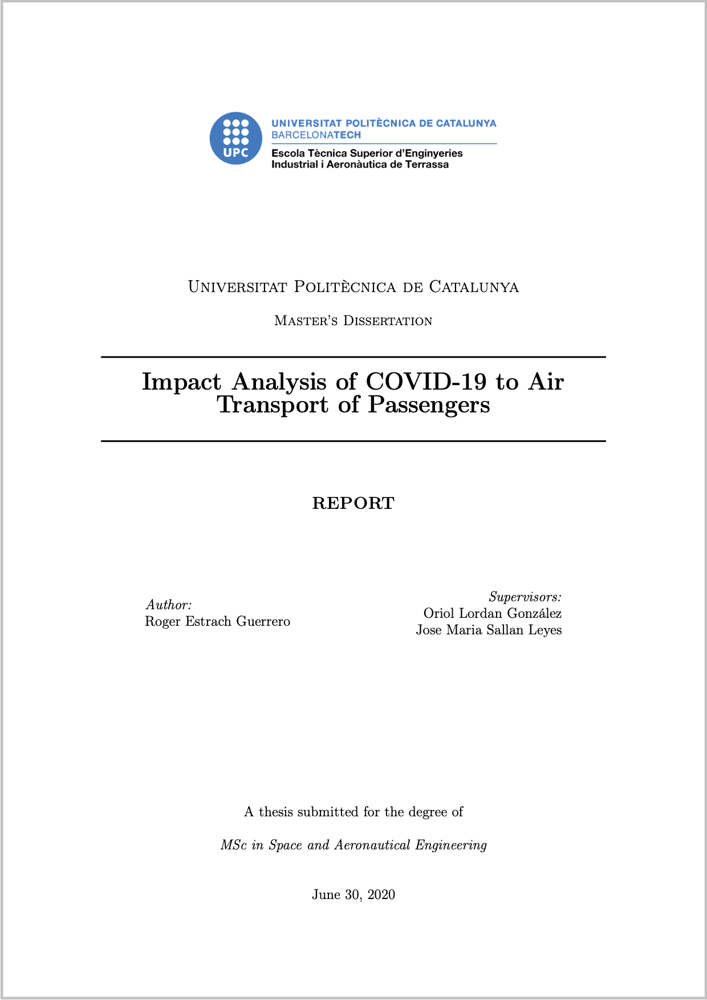

--- 
site: bookdown::bookdown_site
output:
  bookdown::gitbook:
    split_by: "chapter"       # Páginas por secciones (en lugar de capítulos)
    split_bib: no             # No se muestra bibliografía al final de cada página
    lib_dir: "book_assets"
  bookdown::pdf_book:
    keep_tex: yes
documentclass: book
bibliography: [book.bib]
biblio-style: apalike
link-citations: yes
github-repo: rstudio/bookdown-demo

---

# Impact Analysis of COVID-19 to Air Transport of Passengers {-}

```{r portada, echo=FALSE, out.width='80%', fig.align='center'}

```
